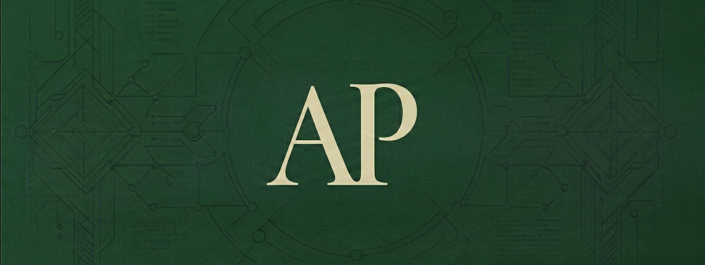

# hey, I'm Arav 👋

AI x Crypto builder. Interested in the agent economy — what happens when AI agents need to transact, build reputation, and operate autonomously onchain.

Previously FDE at [HappyRobot (YC W23)](https://happyrobot.ai), deploying AI agents for enterprise clients in production. Now building at the intersection of AI and blockchain.

---

## what I'm building

- **AgentFICO** — decentralized credit scoring for AI agents on Filecoin. Agents need reputation too.
- **KeyLog** — macOS keystroke capture tool that generates end-of-day summaries + X posts via Claude API
- Exploring **ERC-8004** and **x402** standards for the AI agent economy

---

## stack

**AI & Agents:** LLMs, RAG, LangChain, MCPs, Tool Calls, Prompt Engineering, Agentic Infra, Vector DBs

**Blockchain:** Solidity, Filecoin, Synapse SDK, ERC-8004, x402, DeFi primitives

**Cloud & DevOps:** AWS (EKS, EC2, S3, Lambda, RDS), Terraform, Kubernetes, Docker, CI/CD

**Backend:** Python, FastAPI, Node.js, Rust (learning), PostgreSQL, RESTful APIs, Webhooks

**Frontend:** React, Next.js, TypeScript

---

## featured projects

| Project | Description |
|--------|-------------|
| **[fs-upload-dapp](https://github.com/aravpatel19/fs-upload-dapp)** | Open source contribution — fixed MetaMask wallet connection on a Filecoin SynapseSDK dApp |
| **[acme-logistics-api](https://github.com/aravpatel19/acme-logistics-api)** | Inbound carrier sales API for freight brokers integrated with HappyRobot voice AI — 37% booking conversion, <200ms latency |
| **[aravpatel.com](https://github.com/aravpatel19/aravpatel-portfolio)** | AI-powered interactive portfolio — ask it anything, it responds as me |
| **[nodejs-eks-infrastructure](https://github.com/aravpatel19/nodejs-eks-infrastructure)** | Full AWS EKS stack with Terraform, zero-downtime Kubernetes deploys, GitHub Actions CI/CD |
| **[clinical-fact-checking-system](https://github.com/aravpatel19/clinical-fact-checking-system)** | Multimodal RAG pipeline for pharmaceutical claim validation — 75%+ accuracy |
| **[deepseek-agentic-rag](https://github.com/aravpatel19/deepseek-agentic-rag)** | Conversational Agentic RAG over DeepSeek API docs using GPT-4o-mini + crawl4ai |

---

## find me

- 🌐 [aravpatel.com](https://aravpatel.com)
- 🐦 [X @aravpatel_](https://twitter.com/aravpatel_)
- 💼 [LinkedIn](https://www.linkedin.com/in/aravpatel-/)
- ✉️ aravpatel2319@gmail.com
